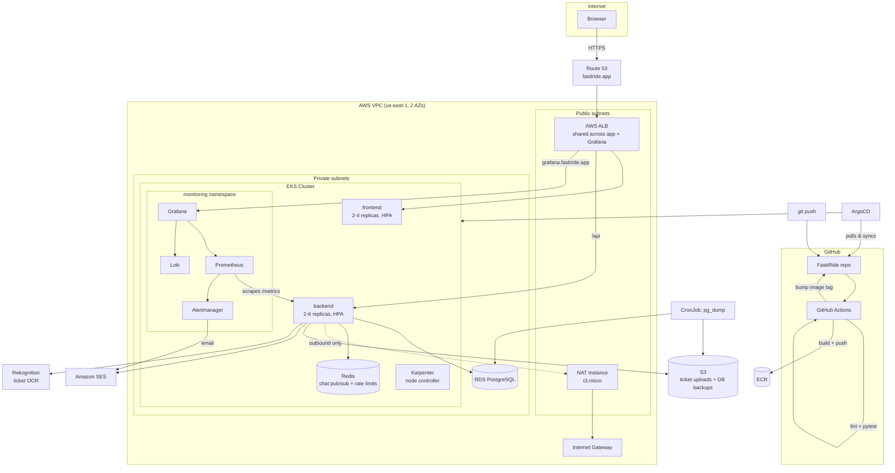
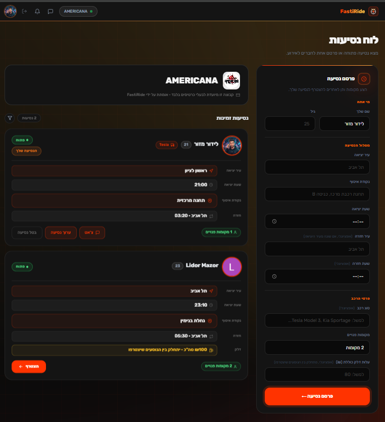
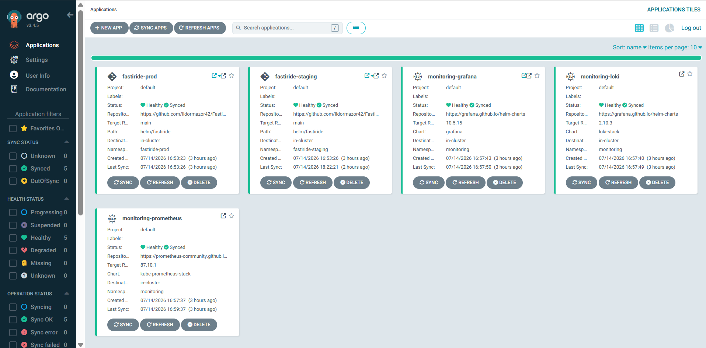
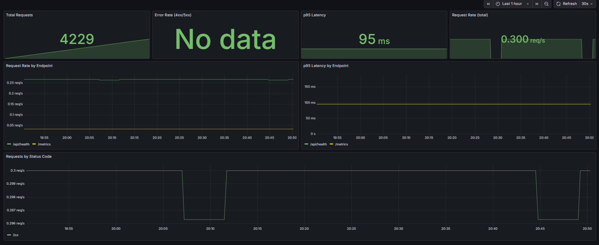
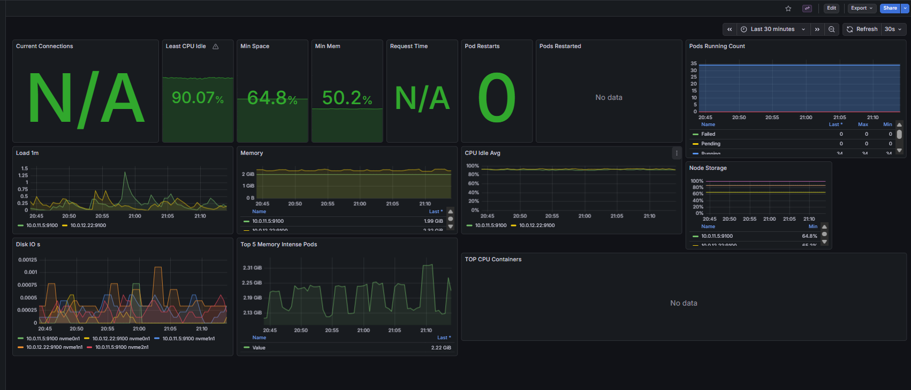
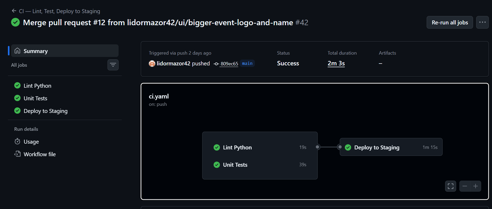
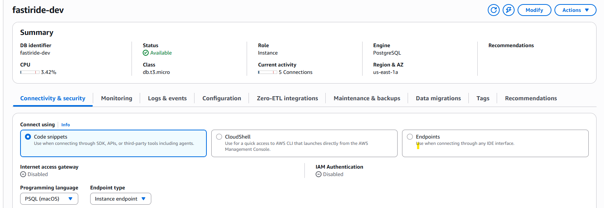

# FastiRide

[](https://github.com/lidormazor42/FastiRide/actions/workflows/ci.yaml)
[](https://github.com/lidormazor42/FastiRide/actions/workflows/iac-quality.yaml)

A ride-sharing platform for festival attendees — built as an end-to-end DevOps capstone project. The app itself (who's driving where) is secondary to the point of the exercise: a real application, fully containerized, deployed to a managed Kubernetes cluster on AWS, with GitOps continuous delivery and full observability, defined entirely as code.

## Stack

| Layer | Technology | Why |
|---|---|---|
| Backend | FastAPI (Python) | async-native, automatic OpenAPI docs, easy to instrument |
| Frontend | Nginx + vanilla HTML/JS | no build step, keeps the container tiny |
| Database | Amazon RDS (PostgreSQL 16) | managed backups/patching — see FinOps log for why this replaced a StatefulSet |
| Container Runtime | Docker | standard, and what Compose/K8s both expect |
| Orchestration | Kubernetes (Amazon EKS) | the actual subject of the course |
| Packaging | Helm | one chart, per-environment value files (`values.yaml` + `values-staging.yaml`/`values-prod.yaml`) — no duplicated manifests |
| IaC | Terraform (S3 remote state) | every AWS resource is code, nothing clicked into existence |
| CI | GitHub Actions | lint → unit tests → build → push → GitOps commit |
| CD | ArgoCD | pulls from Git, not pushed to by CI — Git is the only source of truth |
| Metrics | Prometheus (kube-prometheus-stack) | scrapes the cluster *and* a custom `/metrics` endpoint on the backend |
| Dashboards | Grafana | one custom dashboard (RED method) built for this app's actual metrics |
| Logs | Grafana Loki + Promtail | log aggregation without running an Elasticsearch cluster |
| Alerting | Alertmanager → SES (email) | real notifications, not just dashboards nobody looks at |
| Secrets | AWS SSM Parameter Store (SecureString) | nothing sensitive committed to Git |
| Chat transport | Redis (pub/sub) | lets the backend run multiple replicas — a chat message from one pod reaches a client connected to another |
| Rate limiting | slowapi, Redis-backed | shared quota across all replicas, not one per pod — protects the paid Rekognition call specifically |
| Pod autoscaling | HPA (`metrics-server`) | backend 2-6 replicas / frontend 2-4, on real CPU load |
| Node autoscaling | Karpenter | provisions an EC2 node in under a minute when HPA needs more room than the static nodes have, removes it once idle — on-demand only, no spot |
| Network isolation | Kubernetes NetworkPolicy | default-deny-ingress per namespace + explicit allows (ALB, Prometheus, same-namespace redis) — verified to actually block, not just declared |

## Architecture



**How a deploy actually happens:** push to `main` → GitHub Actions lints, runs the pytest suite, and (only if both pass) builds and pushes Docker images to ECR → CI commits the new image tag into `helm/fastiride/values-staging.yaml` (a "GitOps trigger", not a direct deploy) → ArgoCD notices the Git change on its next poll and deploys it to **staging**. **Nothing ever deploys by CI pushing to the cluster directly** — Git is the only thing ArgoCD trusts. Production only moves when someone deliberately pushes a version tag (see below) — a merge to `main` alone is never enough to reach `fastiride.app`.

### Environments

Local Docker Compose is dev. On AWS, there are **two environments sharing one EKS cluster, one RDS instance (separate databases), and one ALB** — not two full AWS footprints, which would double the cost for a personal project with a single maintainer:

| | Local (dev) | Staging | Production |
|---|---|---|---|
| Domain | — | `staging.fastiride.app` | `fastiride.app` |
| Namespace | — | `fastiride-staging` | `fastiride-prod` |
| Database | Postgres container | `fastiride_staging` (same RDS instance) | `fastiride` (same RDS instance) |
| Deploys on | `docker compose up` | every merge to `main` (automatic) | a pushed version tag (`v1.2.0`) — deliberate, promotes the exact image already validated on staging |
| Replicas | — | backend 2-6 / frontend 2-4 (HPA) | backend 2-6 / frontend 2-4 (HPA) |

### Git flow

**GitHub Flow**, not GitFlow — no long-lived `develop` branch. `feature/*` branches → PR into `main` (branch-protected: PR required, lint+tests must run). Every merge to `main` auto-deploys to staging. When a change has been checked out on staging and is ready for real users, tag it:

```bash
git tag v1.2.0 && git push origin v1.2.0
```

That tag push triggers `promote-to-production.yaml`, a separate workflow that does **not rebuild anything** — it copies staging's already-built, already-validated image tags into `values-prod.yaml`. Production only ever runs an artifact that already ran on staging first.

### FinOps Decision Log

| Decision | What | Why |
|---|---|---|
| NAT Instance, not NAT Gateway | t3.micro EC2 acting as router | Saves ~$32/month vs. a managed NAT Gateway |
| RDS, not a K8s StatefulSet | Managed Postgres in a private subnet | Automated backups/patching; this *was* a StatefulSet during early development to save cost while iterating fast — migrated once the schema stabilized (see Problems & Solutions) |
| Loki, not ELK | Grafana Loki + Promtail | An Elasticsearch cluster is heavy for this scale; Loki integrates natively with the same Grafana already in use for metrics |
| Alertmanager → SES, not Slack | Reused the SES identity already set up for the app's own notifications | Zero new external accounts/services to configure |
| Self-hosted monitoring, not CloudWatch | Prometheus/Grafana/Loki inside the cluster | CloudWatch Logs bills per GB ingested — self-hosting on already-provisioned nodes is close to free (see below) |
| Hand-written Terraform modules, not the public registry ones | Custom `vpc`/`eks`/`rds`/etc. modules | Full control over exactly what gets created — easier to explain every single resource in an exam setting than a large third-party module with defaults you didn't choose |
| One shared ALB, not two | Grafana's Ingress uses the same `alb.ingress.kubernetes.io/group.name` as the app's | Avoids paying for and managing a second load balancer just to expose a dashboard |
| VPC CNI prefix delegation | `ENABLE_PREFIX_DELEGATION=true` + custom `maxPods` on the node launch template | Raised the pods-per-node ceiling from 17 to 110 for free, instead of adding a third EC2 node |
| Karpenter: on-demand only, no spot | `capacity-type: ["on-demand"]` in the NodePool | Spot adds real complexity (interruption handling) for a demo whose whole point was proving the provisioning mechanism, not squeezing the last cent out of it |
| No in-cluster Redis persistence | `redis:7-alpine`, `--save "" --appendonly no`, no PVC | It's pure transport (chat messages persist in Postgres, rate-limit counters are disposable) — a PVC would be paying for durability nothing needs |

**Actual added cost of Monitoring:** ~$3.50/month (35GB of EBS storage for Prometheus/Loki/Grafana) — no extra compute (reuses existing node headroom) and no extra load balancer. This project runs almost entirely on the free part of the AWS bill; the two AWS Budget alerts in `terraform/budget-alerts.tf` exist specifically to catch anything that stops being true.

## Project Structure

```
FastiRide/
├── backend/            FastAPI app, Dockerfile, tests/ (pytest)
├── frontend/            Nginx + HTML/JS, Dockerfile
├── terraform/           IaC — vpc, ecr, eks, rds, uploads (S3), dns, github-oidc, budget-alerts, ses-alerting
├── helm/fastiride/       Helm chart — Deployments (backend/frontend/redis), Service, Ingress, HPA, PDB, NetworkPolicy, Postgres backup CronJob
├── k8s/argocd/           ArgoCD Applications (staging + prod + monitoring stack + metrics-server + karpenter)
├── k8s/karpenter/        EC2NodeClass/NodePool template — applied via scripts/karpenter-demo.sh (subnet/SG IDs are per-apply dynamic, not static)
├── monitoring/           Prometheus/Loki/Grafana values.yaml — deployed via ArgoCD, not manual helm
├── scripts/              bootstrap-prod.sh / teardown-prod.sh / derive-ses-smtp-password.py
├── .github/workflows/    ci.yaml (lint → pytest → build → deploy staging), promote-to-production.yaml (version tag)
├── PROJECT_BOOK.md       Full write-up in Hebrew (architecture, tools, problems & solutions, exam prep)
└── docs/images/          Screenshots referenced below
```

## Getting Started

### Prerequisites

AWS CLI, Terraform >= 1.6, kubectl, Helm, Docker, `gh` CLI. Everything below assumes AWS credentials with permission to create the resources in `terraform/`.

### Local development (dev)

```bash
docker compose up -d
# Backend:  http://localhost:8000
# Frontend: http://localhost
```

### AWS deployment (staging + production)

```bash
cd terraform
terraform init
terraform apply -var-file="dev.tfvars"   # yes, "dev.tfvars" — see naming note below
cd ..
./scripts/bootstrap-prod.sh              # installs LBC, ArgoCD, secrets, then deploys BOTH fastiride-staging and fastiride-prod
```

One run of this script brings up both environments (they share the cluster). From here on, staging updates itself on every merge to `main`; production only moves when you push a version tag (see Git flow above).

**Naming note:** AWS resources (`fastiride-dev` cluster, IAM roles, etc.) kept their original `dev` names — renaming them would mean destroying and recreating the whole cluster for a cosmetic change. The Kubernetes-level naming (`fastiride-staging`/`fastiride-prod` namespaces, `staging.fastiride.app`/`fastiride.app` domains) is what actually reflects the real environments.

### Accessing ArgoCD and Grafana

```bash
kubectl port-forward -n argocd svc/argocd-server 8080:443
# https://localhost:8080 — username `admin`, password: kubectl -n argocd get secret argocd-initial-admin-secret -o jsonpath='{.data.password}' | base64 -d
```

Grafana is public at `https://grafana.fastiride.app` (no port-forward needed — see the shared-ALB decision above).

### Tear down (stop paying)

```bash
./scripts/teardown-prod.sh
```

Deletes the ArgoCD-managed apps first (so the ALB gets cleanly released), then destroys VPC/EKS/RDS via Terraform. ECR, the Route 53 zone, and the S3 buckets are deliberately left alive — they cost about $0.50/month combined.

## Screenshots

- [x] `docs/images/app-board.png` — the ride board in the browser
- [x] `docs/images/argocd-apps.png` — ArgoCD showing all Applications Synced/Healthy
- [x] `docs/images/grafana-red-dashboard.png` — the custom FastiRide Backend dashboard
- [x] `docs/images/grafana-cluster-dashboard.png` — the Kubernetes Cluster Overview dashboard
- [x] `docs/images/ci-pipeline.png` — a green GitHub Actions run (lint → test → build → push)
- [x] `docs/images/rds-console.png` — the RDS instance, `available`

**The ride board:**


**ArgoCD — all Applications Synced/Healthy:**


**Grafana — FastiRide Backend (RED method):**


**Grafana — Kubernetes Cluster Overview:**


**CI/CD — a green pipeline run:**


**RDS — managed PostgreSQL, `available`:**


## Managing the Cluster with k9s

k9s is a terminal UI for Kubernetes — faster to navigate than raw `kubectl` once the cluster is up.

```bash
k9s                # launch
k9s -n monitoring  # open directly in a namespace
k9s --readonly     # safe browsing mode
```

| Shortcut | Action |
|---|---|
| `:pod` / `:deploy` / `:svc` | switch resource view |
| `:ns` | switch namespace |
| `l` | view logs |
| `d` | describe |
| `s` | shell into container |
| `ctrl-d` | delete |
| `?` | all shortcuts |
